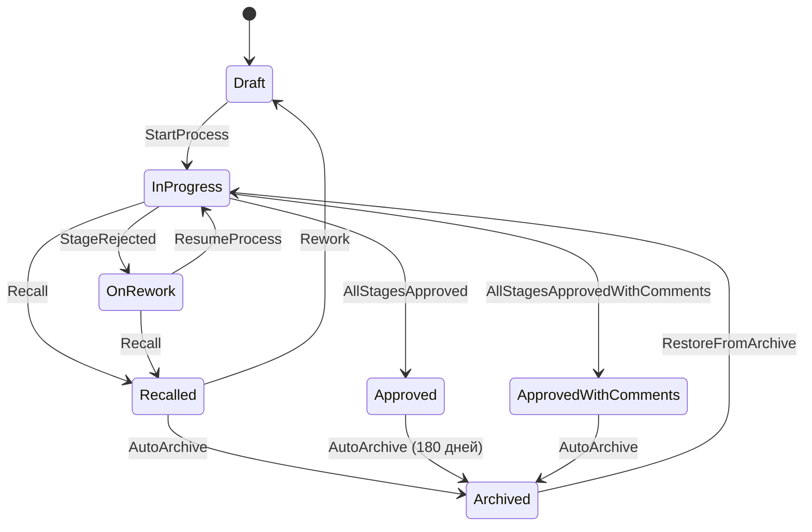
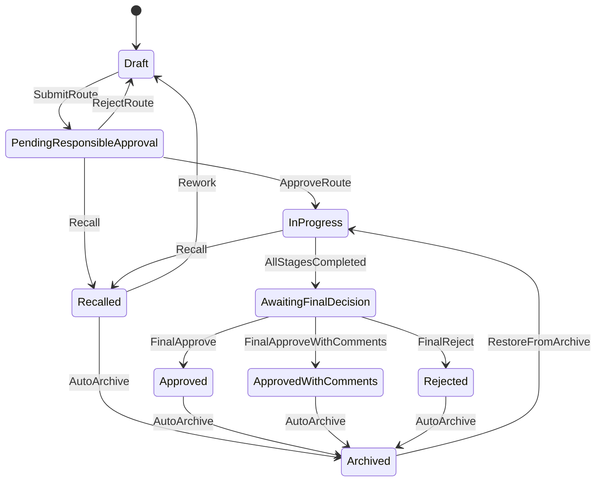
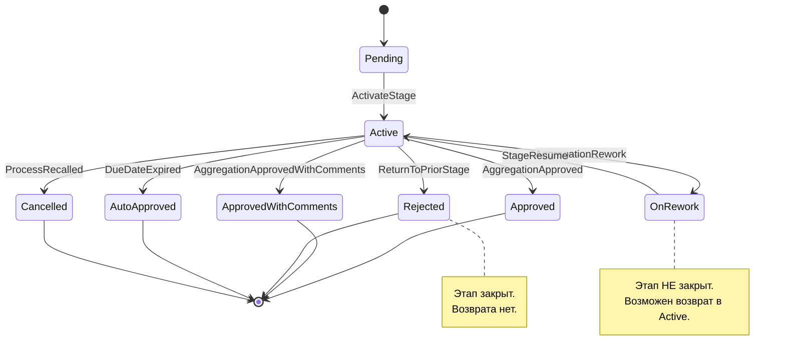
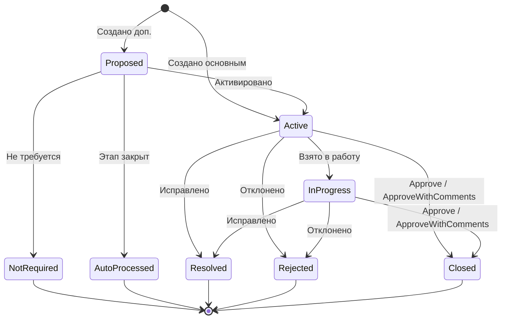

# Машины состояний

**Версия:** 2.0  
**Назначение:** полное описание состояний, переходов, guards и actions

---

## Оглавление

1. Назначение и обоснование
2. Ключевые понятия
3. Общая модель
4. ProcessStateMachine
5. StageStateMachine
6. StageIterationStateMachine
7. ParticipantStateMachine
8. AdditionalApproverStateMachine
9. FinalDecisionStateMachine
10. RemarkStateMachine
11. Выбор целевого этапа при возврате
12. Ревизии документа
13. Архивация
14. Управление конфигом
15. Сводные инварианты

---

## 1. Назначение и обоснование

### 1.1 Что такое state machine

**State machine** (машина состояний) — модель, которая описывает:
- какие состояния есть у сущности;
- какие переходы между состояниями возможны;
- при каких условиях переход разрешён;
- какие действия выполняются при переходе.

### 1.2 Зачем нужна

- Единая точка описания жизненного цикла.
- Гибкость: изменения без релиза.
- Аудит: понятно, когда и почему произошёл переход.
- Валидация: нельзя сделать недопустимый переход.

### 1.3 Движок

**В качестве движка используется собственная реализация (`TransitionEngine`), см. `11_adr.md` ADR-028.** Движок исполняет алгоритм перехода, описанный в §3.3 ниже, читает конфигурацию из `state_machine_config`/`state_config`/`transition_config` и резолвит guards/actions как Spring-бины через `guard_registry`/`action_registry` — модель конфигурации не изменилась (ADR-002). Текущее состояние хранится непосредственно в поле `status` самой сущности (валидируется через `status_registry`, ADR-015), без отдельной таблицы персистентности контекста.

**Историческая справка.** До 2026-09-18 движком являлся Spring State Machine 4.0.0 (ADR-011). Библиотека была архивирована сопровождающей командой без поддержки Spring Boot 4 и заменена собственной реализацией при переходе на Spring Boot 4.0.3 (ADR-028); прежнее решение сохранено в `11_adr.md` как исторический документ (ADR-011, статус «Заменено»).

---

## 2. Ключевые понятия

### 2.1 State (Состояние)

Состояние сущности (процесса, этапа, участника).

### 2.2 Transition (Переход)

Переход между состояниями.

### 2.3 Guard (Условие)

Предикат, который должен быть истинным для выполнения перехода.

### 2.4 Action (Действие)

Побочный эффект перехода.

### 2.5 Trigger (Триггер)

Что вызвало переход.

**Значения:**
- **userAction** — действие пользователя
- **systemAction** — действие системы
- **timer** — таймер

### 2.6 Snapshot-on-Start

При запуске процесса фиксируется версия конфига и шаблона.

### 2.7 Fork & Drain

Старые версии шаблонов и конфигов живут, пока есть активные процессы на них.

---

## 3. Общая модель

### 3.1 Сущности с состоянием

| Сущность | State-machine |
|---|---|
| ProcessInstance | ProcessStateMachine |
| StageInstance | StageStateMachine |
| StageIteration | StageIterationStateMachine |
| Participant | ParticipantStateMachine |
| AdditionalApprover | AdditionalApproverStateMachine |
| FinalDecision | FinalDecisionStateMachine |
| Remark | RemarkStateMachine |

**Убрано:** `ProcessIteration` как отдельная сущность. «Итерация процесса» — вычисляемое представление для UI.

### 3.2 Модель конфига

```
StateMachineConfig
├── entityType
├── processType
├── version
├── states[]
├── transitions[]
└── status: Draft | Published | Deprecated | Archived
```

### 3.3 Алгоритм перехода

```
1. Найти переходы по (entityType, fromState, trigger, processType)
2. Отсортировать по priority
3. Для каждого:
   a. Проверить guards
   b. Если все true → actions, сменить state, опубликовать events
   c. AuditEvent
   d. Выход
4. Если ни один не сработал → ошибка/игнор
```

### 3.4 Стратегия версионирования

| Аспект | Значение | Обоснование |
|---|---|---|
| Фиксация | Snapshot-on-Start | Процесс не меняет поведение |
| Изоляция | Fork & Drain | Старые версии живут |
| Публикация | Только админ | Контроль |
| Удаление | Только при `activeProcessCount = 0` | Нельзя ломать работающие процессы |
| Изменения | Только additive | Безопасность |

---

## 4. ProcessStateMachine

### 4.1 Состояния

| Код | Русское название | Терминальное | Процесс |
|---|---|---|---|
| Draft | Черновик | Нет | Оба |
| PendingResponsibleApproval | Ожидает согласования маршрута | Нет | UNIFIED |
| InProgress | В процессе | Нет | Оба |
| OnRework | На доработке | Нет | STANDARD |
| AwaitingFinalDecision | Ожидает финального решения | Нет | UNIFIED |
| Recalled | Отозван | Нет | Оба |
| Approved | Согласован | Нет | Оба |
| ApprovedWithComments | Согласован с замечаниями | Нет | Оба |
| Rejected | Отклонён | Нет | UNIFIED |
| Archived | Архивирован | Да | Оба |

**Убрано:** `OnProcessRework` как отдельное состояние.

### 4.2 Переходы STANDARD

| Код | From | To | Trigger | Guards |
|---|---|---|---|---|
| StartProcess | Draft | InProgress | userAction | IsInitiator, AllMandatorySlotsFilled, AllDurationsValid |
| StageRejected | InProgress | OnRework | systemAction | AnyStageRejected |
| ResumeProcess | OnRework | InProgress | userAction | IsInitiator, AllActiveRemarksHandled, IsValidReturnTarget |
| AllStagesApproved | InProgress | Approved | systemAction | AllStagesApproved |
| AllStagesApprovedWithComments | InProgress | ApprovedWithComments | systemAction | AllStagesApprovedWithComments |
| RecallProcess | InProgress, OnRework | Recalled | userAction | IsInitiator |
| ReworkFromRecalled | Recalled | Draft | userAction | IsInitiator |
| AutoArchiveApproved | Approved | Archived | timer | AutoArchiveTimeReached |
| AutoArchiveApprovedWithComments | ApprovedWithComments | Archived | timer | AutoArchiveTimeReached |
| AutoArchiveRecalled | Recalled | Archived | timer | AutoArchiveTimeReached |
| RestoreFromArchive | Archived | Previous | userAction | IsAdmin |

### 4.3 Переходы UNIFIED

| Код | From | To | Trigger | Guards |
|---|---|---|---|---|
| SubmitRoute | Draft | PendingResponsibleApproval | userAction | IsInitiator |
| ApproveRoute | PendingResponsibleApproval | InProgress | userAction | IsResponsible |
| RejectRoute | PendingResponsibleApproval | Draft | userAction | IsResponsible |
| AllStagesCompleted | InProgress | AwaitingFinalDecision | systemAction | AllStagesCompleted |
| FinalApprove | AwaitingFinalDecision | Approved | userAction | IsResponsible |
| FinalApproveWithComments | AwaitingFinalDecision | ApprovedWithComments | userAction | IsResponsible |
| FinalReject | AwaitingFinalDecision | Rejected | userAction | IsResponsible |
| RecallFromPending | PendingResponsibleApproval | Recalled | userAction | IsInitiator |
| RecallFromProgress | InProgress | Recalled | userAction | IsInitiator |
| ReworkFromRecalled | Recalled | Draft | userAction | IsInitiator |
| AutoArchive* | Approved, ApprovedWithComments, Rejected, Recalled | Archived | timer | AutoArchiveTimeReached |
| RestoreFromArchive | Archived | Previous | userAction | IsAdmin |

### 4.4 Жизненный цикл STANDARD



### 4.5 Жизненный цикл UNIFIED



---

## 5. StageStateMachine

### 5.1 Состояния

| Код | Русское название | Терминальное | Процесс |
|---|---|---|---|
| Pending | Ожидает | Нет | Оба |
| Active | Активен | Нет | Оба |
| Approved | Согласован | Да | STANDARD |
| ApprovedWithComments | Согласован с замечаниями | Да | STANDARD |
| OnRework | На доработке | Нет | STANDARD |
| Rejected | Отклонён | Да | STANDARD |
| AutoApproved | Автосогласован | Да | STANDARD |
| Completed | Завершён | Да | UNIFIED |
| Cancelled | Отменён | Да | Оба |

### 5.2 Переходы STANDARD

| Код | From | To | Trigger | Guards |
|---|---|---|---|---|
| ActivateStage | Pending | Active | systemAction | PreviousStageCompleted |
| StageApproved | Active | Approved | systemAction | AggregationApproved |
| StageApprovedWithComments | Active | ApprovedWithComments | systemAction | AggregationApprovedWithComments |
| StageOnRework | Active | OnRework | systemAction | AggregationRework |
| StageAutoApproved | Active | AutoApproved | timer | DueDateExpired |
| CancelStage | Active | Cancelled | systemAction | ProcessRecalled |
| StageResume | OnRework | Active | userAction | IsInitiator, NewIterationCreated |
| StageRejectedByReturn | Active | Rejected | systemAction | ReturnToPriorStage |

**Режимы агрегации (`decisionMode`).** Guards `AggregationApproved` / `AggregationApprovedWithComments` / `AggregationRework` — параметризованные предикаты, единая логика которых (функция `evaluateAggregation(stage)`) реализует все 5 значений `decisionMode` (`AND`, `ANY_APPROVE`, `ANY_REJECT`, `ANY_DECISION`, `FIRST_REJECT_FAIL_FAST`) — см. `05_guards_actions_registry.md` §4.2. До ADR-022 эти guards (тогда — `AllApproved`/`AllApprovedWithComments`/`AnyRejected`) поддерживали только режим `AND`.

**Триггер `StageRejectedByReturn` (уточнение, подтверждено — см. ADR-025).** Guard `ReturnToPriorStage` (G-S-007, `05_guards_actions_registry.md` §4.2: `returnTargetStage.orderIdx < currentStage.orderIdx`) определён корректно и сохраняется без изменений. Расхождение, найденное при рецензии, было не в самом guard'е, а в том, что таблица переходов описывала `StageRejectedByReturn` как самостоятельную, независимо срабатывающую транзицию этапа, тогда как по алгоритму возврата (§11.4–11.5) перевод промежуточных этапов в `Rejected` управляется **действием на уровне процесса**: `A-RT-002 RejectStagesFrom`, выполняемое как часть перехода `ResumeProcess`, находит все Active-этапы с `orderIdx > target` и явно посылает каждому такому `StageInstance` системный триггер `StageRejectedByReturn` на его собственной `StageStateMachine`, передавая выбранный алгоритмом `target` как `returnTargetStage` для guard'а. Таким образом переход `StageRejectedByReturn` остаётся явным, штатно проходит guard `ReturnToPriorStage` и полный цикл обработки (persist, AuditEvent, публикация событий) — но инициируется программно действием процесса, а не как отдельно всплывающая пользовательская или системная транзиция уровня этапа. Это сохраняет принцип «любое изменение состояния — только через явный переход state machine» (ADR-002). Пользователь подтвердил это решение как финальное на ревью 2026-09-18 — вопрос закрыт, дальнейшего пересмотра не требуется.

### 5.3 Переходы UNIFIED

| Код | From | To | Trigger |
|---|---|---|---|
| ActivateStageUnified | Pending | Active | systemAction |
| StageCompleted | Active | Completed | systemAction |
| StageAutoCompleted | Active | Completed | timer |
| CancelStageUnified | Active | Cancelled | systemAction |

### 5.4 Ключевое правило

> **Этап не может быть закрыт с итогом «Отклонён», если он идёт на новую итерацию этапа.** В этом случае он получает статус **На доработке**.

> **Этап закрывается со статусом «Отклонён»**, только если после него создаётся новая итерация другого (более раннего) этапа или если инициатор возвращает документ на другой этап.

### 5.5 Жизненный цикл STANDARD



---

## 6. StageIterationStateMachine

### 6.1 Состояния

| Код | Русское название | Терминальное |
|---|---|---|
| Active | Активна | Нет |
| Completed | Завершена | Да |
| Superseded | Заменена | Да |
| Cancelled | Отменена | Да |

### 6.2 Переходы

| Код | From | To | Trigger | Guards |
|---|---|---|---|---|
| CompleteIteration | Active | Completed | systemAction | StageCompleted |
| SupersedeIteration | Active | Superseded | systemAction | ReworkInitiated |
| CancelIteration | Active | Cancelled | systemAction | ProcessRecalled |

### 6.3 Логика создания итераций

> **При активации любого этапа:** если у этапа уже есть итерации — создать новую (инкремент `iterationIdx`). Иначе — Iter 1.

**Работает одинаково для всех случаев:**
- Нормальный переход на следующий этап.
- Возврат на любой этап (в т.ч. ранее согласованный).

### 6.4 Вычисление «итерации процесса»

**ProcessIteration** — вычисляемое представление, не хранится физически.

**Формула:**
```
processIteration = max(stageIteration.iterationIdx)
```

**Зачем:** для группировки и отображения в листе согласования.

---

## 7. ParticipantStateMachine

### 7.1 Состояния

| Код | Русское название | Терминальное |
|---|---|---|
| Pending | Ожидает назначения | Нет |
| Assigned | Назначен | Нет |
| InProgress | В работе | Нет |
| Decided | Решение принято | Да |
| AutoApproved | Автосогласован | Да |
| Revoked | Отозван | Да |
| Cancelled | Отменён | Да |

**`Pending`** — добавлено ADR-022 для поддержки `executionOrder = Sequential`: участник создан, но ещё не получил задачу, потому что ожидает решения предыдущих по `orderIdx` участников. Для `executionOrder = Parallel` состояние `Pending` не используется — все участники стартуют в `Assigned` (см. `05_guards_actions_registry.md` A-S-001).

### 7.2 Переходы

| Код | From | To | Trigger | Guards |
|---|---|---|---|---|
| AssignTask | Pending | Assigned | systemAction | CanAssignTask |
| StartWork | Assigned | InProgress | userAction | IsParticipant |
| Decide | Assigned, InProgress | Decided | userAction | IsParticipant, HasValidDecision |
| AutoApprove | Assigned, InProgress | AutoApproved | timer | DueDateExpired |
| RevokeParticipant | Assigned, InProgress | Revoked | systemAction | StageClosed OR IterationSuperseded |
| CancelParticipant | Assigned, InProgress | Cancelled | systemAction | ProcessRecalled |

**Убрано (ADR-024):** переход `ReassignParticipant` и `substitutionRef` из модели. Функциональность замещений участников убрана из модуля целиком — см. `00_vision_scope.md` §3, `11_adr.md` ADR-024.

**Действие `AssignNextParticipantTask` (A-S-009).** Выполняется как побочный эффект переходов `Decide` и `AutoApprove`. Для `executionOrder = Sequential` находит следующего участника этапа в состоянии `Pending` с минимальным `orderIdx` и переводит его в `Assigned` (программный аналог перехода `AssignTask`, инициируемый действием, а не пользователем). Для `executionOrder = Parallel` — no-op, так как `Pending`-участников не существует.

**Начальное состояние при назначении задач этапа (`A-S-001 AssignParticipantTasks`):**

| `executionOrder` | Начальное состояние участников |
|---|---|
| `Parallel` (по умолчанию) | Все — `Assigned` |
| `Sequential` | Первый по `orderIdx` — `Assigned`; остальные — `Pending` |

---

## 8. AdditionalApproverStateMachine

### 8.1 Состояния

| Код | Русское название | Терминальное |
|---|---|---|
| Assigned | Назначен | Нет |
| InProgress | В работе | Нет |
| Recommended | Рекомендация дана | Да |
| AutoRevoked | Автоотозван | Да |
| Removed | Удалён | Да |

### 8.2 Переходы

| Код | From | To | Trigger | Guards |
|---|---|---|---|---|
| StartWork | Assigned | InProgress | userAction | IsAdditionalApprover |
| Recommend | Assigned, InProgress | Recommended | userAction | — |
| AutoRevoke | Assigned, InProgress | AutoRevoked | systemAction | MainApproverDecided |
| Remove | Assigned, InProgress | Removed | userAction | ProcessInRecalledOrOnRework, isDeletable |

### 8.3 Особенности

**Иерархия.** Доп. согласующий может добавить другого доп. согласующего (переход `AddChild`).

**Действия при добавлении ребёнка:**

| Action | Что делает |
|---|---|
| `CreateChildAdditionalApprover` | Создаёт нового доп. согласующего с `parentAdditionalApproverId` |
| `SetLevel` | Вычисляет `level = parent.level + 1` |
| `AssignTask` | Назначает задачу новому доп. согласующему |

**Правила:**
- Глубина иерархии не ограничена.
- Количество не ограничено.
- Все замечания и рекомендации поднимаются до основного.

---

## 9. FinalDecisionStateMachine

### 9.1 Состояния

| Код | Русское название | Терминальное |
|---|---|---|
| Pending | Ожидает | Нет |
| Decided | Принято | Да |

### 9.2 Переходы

| Код | From | To | Trigger | Guards |
|---|---|---|---|---|
| RecordFinalDecision | Pending | Decided | userAction | IsResponsible |

**Особенность:** финальное решение **immutable**. Дальнейших переходов нет.

---

## 10. RemarkStateMachine

### 10.1 Состояния

| Код | Русское название | Терминальное |
|---|---|---|
| Proposed | Предложено | Нет |
| Active | Действующее | Нет |
| InProgress | В работе | Нет |
| NotRequired | Не требуется | Да |
| AutoProcessed | Авто-обработано | Да |
| Resolved | Исправлено | Да |
| Rejected | Отклонено | Да |
| Closed | Закрыто | Да |

### 10.2 Переходы

| Код | From | To | Trigger | Guards |
|---|---|---|---|---|
| ActivateRemark | Proposed | Active | userAction | IsMainApprover, ParticipantNotDecided |
| MarkNotRequired | Proposed | NotRequired | userAction | IsMainApprover |
| AutoProcessRemark | Proposed | AutoProcessed | systemAction | StageClosed |
| TakeIntoWork | Active | InProgress | userAction | IsInitiator |
| ResolveRemark | Active, InProgress | Resolved | userAction | IsInitiator |
| RejectRemark | Active, InProgress | Rejected | userAction | IsInitiator, HasReason |
| CloseRemark | Active, InProgress | Closed | systemAction | ApproveOrApproveWithComments |

### 10.3 Жизненный цикл



---

## 11. Выбор целевого этапа при возврате

### 11.1 Условие применения

**Работает всегда** — независимо от `processIterationEnabled`.

### 11.2 Логика

```
1. Этап отклонён
2. Процесс → OnRework
3. Инициатор обрабатывает замечания
4. Нажимает «Возобновить»
5. Если allowedReturnStages содержит > 1 этап → модалка выбора
6. Инициатор выбирает targetStageId
7. Выполняется переход ResumeProcess
```

### 11.3 Новые guards

| Код | Название | Что проверяет |
|---|---|---|
| G-RT-001 | `IsValidReturnTarget` | targetStageId ∈ allowedReturnStages текущего этапа |
| G-RT-002 | `AllActiveRemarksHandled` | Нет замечаний в статусах Active / InProgress |

### 11.4 Новые actions

| Код | Название | Что делает |
|---|---|---|
| A-RT-001 | `SupersedeStagesFrom` | Помечает этапы с `orderIdx > target` как SUPERSEDED |
| A-RT-002 | `RejectStagesFrom` | Находит все Active-этапы с `orderIdx > target` и посылает каждому системный триггер `StageRejectedByReturn`, передавая `target` как `returnTargetStage` для guard'а `ReturnToPriorStage` (см. §5.2, ADR-025), переводя их в `Rejected` через штатный переход `StageStateMachine` |
| A-RT-003 | `CreateNewIterationFor` | Создаёт новую итерацию для целевого этапа |
| A-RT-004 | `ActivateStage` | Активирует целевой этап |

### 11.5 Алгоритм

```
resumeProcess(targetStageId):
    1. Guard: IsValidReturnTarget(targetStageId)
    2. Guard: AllActiveRemarksHandled
    3. Action: SupersedeStagesFrom(target)
    4. Action: RejectStagesFrom(target)
       → для каждого Active-этапа с orderIdx > target:
         отправить триггер StageRejectedByReturn его StageStateMachine,
         передав target как returnTargetStage (guard ReturnToPriorStage, см. §5.2, ADR-025)
    5. Action: CreateNewIterationFor(target)
    6. Action: ActivateStage(target)
    7. Process → InProgress
```

### 11.6 Пример

Исходная ситуация: Этап 1 ✅, Этап 2 ✅, Этап 3 ❌.

**Возврат на этап 3:**

```
Stage 1 Iter 1 ✅
Stage 2 Iter 1 ✅
Stage 3 Iter 2 (активный)
```

**Возврат на этап 1:**

```
Stage 1 Iter 2 (активный)
Stage 2 Iter 2 (ждёт)
Stage 3 Iter 2 (ждёт)
```

**Возврат на этап 2:**

```
Stage 1 Iter 1 ✅
Stage 2 Iter 2 (активный)
Stage 3 Iter 2 (ждёт)
```

---

## 12. Ревизии документа

### 12.1 Условие применения

Только при `processIterationEnabled=true` в шаблоне.

### 12.2 Логика создания ревизии

```
1. Инициатор решает, что замечания серьёзные
2. Создаёт новую ревизию через POST /processes/revision
3. Указывает:
   - documentAggregateId
   - revisionLabel (Изм. 1, Доп. 2, ...)
   - interruptPrevious (true / false)
4. Система:
   - Создаёт новый процесс
   - Связывает с агрегатом через documentAggregateId
   - Связывает с предыдущим через parentProcessId
   - Если interruptPrevious=true → предыдущий → RECALLED
5. Новый процесс → Draft → готов к запуску
```

### 12.3 Связь со state machine

**Ревизия не создаёт нового перехода в state machine процесса.** Каждый процесс живёт своей жизнью, а агрегат — внешняя связка через `documentAggregateId`.

**Что меняется:**
- При создании ревизии предыдущий процесс может перейти в `Recalled` (по выбору инициатора).
- Событие `approval.process.revision-created` публикуется.

---

## 13. Архивация

### 13.1 Автоматическая архивация

**Триггер:** истечение 180 дней с момента завершения.

**Условия:**

| Условие | Значение |
|---|---|
| Процесс в финальном состоянии | Approved / ApprovedWithComments / Rejected / Recalled |
| Прошло ≥ 180 дней | Да |
| autoArchiveEnabled | true |

**Действия при архивации:**
- Статус → Archived.
- Отзыв активных задач.
- Публикация `approval.process.auto-archived`.
- Read-only.
- Аудит.

### 13.2 Восстановление

**Триггер:** действие администратора.

**Условия:**
- Пользователь — администратор.
- Процесс в Archived.

**Действия:**
- Возврат в previousStatus.
- Сброс `autoArchiveScheduledAt` на +180 дней.
- Публикация `approval.process.restored`.
- Аудит.

### 13.3 Настройки

```
ArchiveSettings
├── autoArchiveEnabled: Boolean   // true
└── autoArchiveDays: Int           // 180
```

Только глобально.

---

## 14. Управление конфигом

### 14.1 Жизненный цикл версии

```
Draft → Published → Deprecated → Archived
```

### 14.2 Валидации при публикации

- Ровно одно `isInitial`.
- Все `fromState` / `toState` существуют.
- Все guards/actions зарегистрированы.
- Из каждого нефинального — исходящий переход.
- Нет конфликтов `(entityType, fromState, trigger, priority)`.
- Нет удалённых используемых состояний при активных процессах.
- Все `emits` — валидные события.

### 14.3 Миграция

- Snapshot-on-Start.
- Fork & Drain.
- Только additive-изменения для активных версий.

### 14.4 Аудит конфига

```
ConfigAuditEvent
├── configVersion
├── action
├── actorId
├── timestamp
├── diff
└── comment
```

### 14.5 UI редактора

- Список состояний.
- Таблица переходов.
- Выбор guards и actions.
- Публикация.
- Diff.
- Активные процессы по версии.
- Валидация перед публикацией.

### 14.6 Права

- Публикация — только админ.
- Просмотр — все авторизованные.

---

## 15. Сводные инварианты

| Инвариант | Описание |
|---|---|
| Snapshot-on-Start | Процесс не меняет версию конфига |
| Идемпотентность | Повторный trigger не меняет state |
| Транзакционность | Смена state + actions — атомарно |
| События после commit | Через Outbox |
| AuditEvent на каждый переход | Обязательно |
| Этап `Rejected` | Только при возврате на другой этап |
| Этап `OnRework` | При возврате на тот же этап |
| Финальное решение | Immutable |
| AutoArchive | Через 180 дней после завершения |
| Восстановление | Только администратор |
| `allowedReturnStages` | Только прошлые и текущий |
| ProcessIteration | Вычисляется как `max(stageIteration)` |
| Итерации | Без лимита |
| Иерархия доп. согласующих | Без ограничений |
| Агрегация решений этапа | По `stage.decisionMode` (5 режимов), см. `05_guards_actions_registry.md` §4.2 |
| Порядок работы участников | По `stage.executionOrder` (Parallel/Sequential), см. §7.2 |

---
