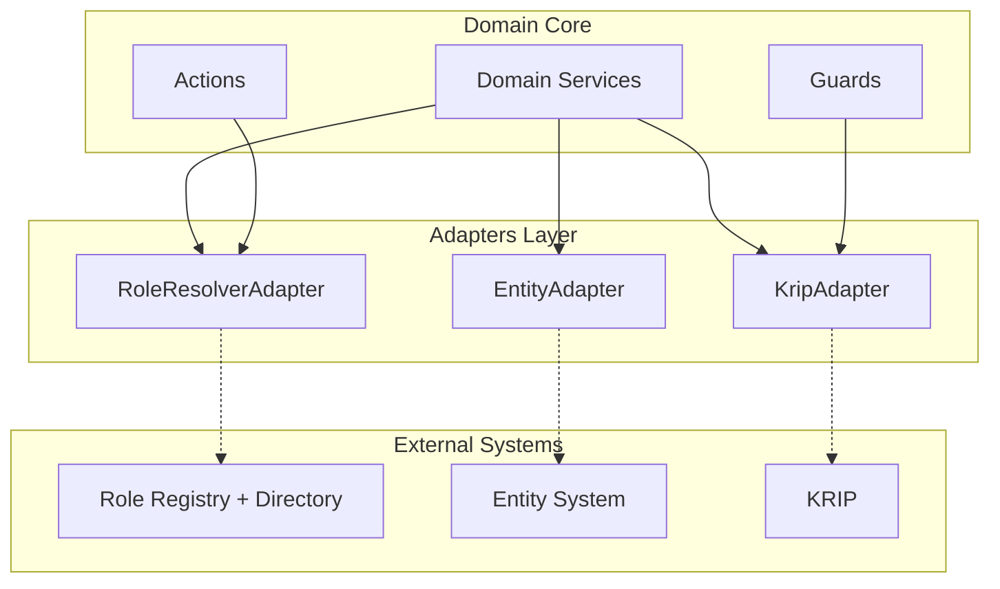

# Адаптеры интеграции

**Версия:** 2.1  
**Назначение:** полное описание адаптеров для интеграции модуля «Согласование» с внешними системами

---

## Оглавление

1. Назначение и обоснование
2. Ключевые понятия
3. Принципы построения адаптеров
4. Общая архитектура
5. Адаптер подбора пользователей по ролям (RoleResolverAdapter)
6. Адаптер сущностей (EntityAdapter)
7. Адаптер проверки полномочий (KripAdapter)
8. Регистрация и внедрение зависимостей
9. Обработка ошибок и таймаутов
10. Мониторинг и наблюдаемость
11. Точки расширения
12. Сводная таблица

---

## 1. Назначение и обоснование

### 1.1 Что такое адаптеры

**Адаптеры** — программные интерфейсы, через которые модуль «Согласование» взаимодействует с внешними системами. Они изолируют доменную логику от конкретных реализаций интеграций.

### 1.2 Зачем нужны адаптеры

**Проблема.** Модуль должен взаимодействовать с внешними системами:

| Внешняя система | Что нужно |
|---|---|
| Справочник сотрудников | Получить данные о сотрудниках |
| Справочник ролей | Получить данные о ролях |
| Система проверки полномочий (КРИП) | Проверить права доступа |
| Система-владелец сущности | Получить снимок сущности |

Без адаптеров:
- Домен зависит от конкретных реализаций.
- Нельзя заменить одну систему на другую.
- Нельзя тестировать изолированно.
- Нельзя использовать модуль без внешних систем.

**Решение.** Ввести **адаптеры** — единые интерфейсы, отделённые от реализаций.

### 1.3 Что это даёт

| Что | Зачем |
|---|---|
| Изоляция | Домен не знает о конкретных системах |
| Заменяемость | Можно подключить другую систему |
| Тестируемость | Можно мокать |
| Расширяемость | Можно добавить новую реализацию |
| Гибкость | Пустые адаптеры позволяют работать без интеграций |

### 1.4 Связь с остальной архитектурой

```
Модуль «Согласование»
├── Domain Core
│   ├── State Machine Engine (Spring State Machine)
│   ├── Guards и Actions
│   └── Domain Services
│
├── Adapters Layer (этот документ)
│   ├── RoleResolverAdapter
│   ├── EntityAdapter
│   └── KripAdapter
│
└── Persistence + Event Publisher
```

**Убрано (ADR-024):** `SubstitutionAdapter`. Функциональность замещения участников убрана из модуля целиком — см. `11_adr.md` ADR-024, `00_vision_scope.md` §3.

---

## 2. Ключевые понятия

### 2.1 Адаптер (Adapter)

**Адаптер** — интерфейс для интеграции с внешней системой. Определяет **что** нужно от внешней системы, но не **как** это получить.

### 2.2 Реализация (Implementation)

**Реализация** — конкретный код адаптера под конкретную внешнюю систему. Например, REST-клиент к КРИП.

### 2.3 Пустая реализация (Empty / No-Op)

**Пустая реализация** — заглушка, которая возвращает безопасные значения по умолчанию. Используется когда:
- внешняя система ещё не подключена;
- модуль работает в тестовом окружении;
- интеграция не нужна для конкретного сценария.

### 2.4 Контекст вызова (Context)

**Контекст вызова** — данные, передаваемые в адаптер: идентификаторы, параметры, текущее состояние процесса.

### 2.5 Fallback

**Fallback** — безопасное поведение при недоступности адаптера.

### 2.6 Events from External Systems

**События от внешних систем** — отдельный поток данных, который в текущей версии модуля не используется (см. ADR-024). При появлении подобной интеграции в будущем она будет спроектирована заново, с собственным ADR.

---

## 3. Принципы построения адаптеров

### 3.1 Изоляция домена

Домен **не знает** о конкретных реализациях. Он работает только с интерфейсами.

**Правило:** доменные сервисы вызывают адаптеры через интерфейсы.

### 3.2 Синхронность

Адаптеры вызывают внешние системы **синхронно** с таймаутом. При таймауте — безопасный fallback.

**Обоснование:**
- простота;
- предсказуемость;
- достаточно для типовых сценариев.

**Асинхронность** — потенциальное расширение.

### 3.3 Идемпотентность

Адаптеры должны быть **идемпотентны** при повторных вызовах.

### 3.4 Безопасные значения по умолчанию

Если адаптер недоступен — модуль использует безопасные значения:
- `null` для резолвинга;
- `true` для проверок (не блокируем);
- пусто для списков.

### 3.5 Таймауты

Каждый вызов адаптера имеет таймаут. По умолчанию — 5 секунд.

### 3.6 Логирование

Вызовы адаптеров **не логируются** по умолчанию (кроме ошибок). Это осознанное решение для производительности.

### 3.7 Конфигурация

Адаптеры настраиваются через конфигурацию:
- включён/выключен;
- таймаут;
- параметры подключения.

### 3.8 Два способа интеграции

| Способ | Когда | Пример |
|---|---|---|
| **Адаптер (синхронный)** | Нужен ответ сейчас | Резолвинг роли, проверка полномочий, снимок сущности |

---

## 4. Общая архитектура

### 4.1 Схема



### 4.2 Список адаптеров

| Адаптер | Назначение | Статус на старте |
|---|---|---|
| `RoleResolverAdapter` | Подбор пользователей по ролям | Пустой |
| `EntityAdapter` | Получение снимка сущности | Реальный |
| `KripAdapter` | Проверка полномочий | Пустой |

### 4.3 Общая структура вызова

```
1. Доменный сервис вызывает метод адаптера
2. Адаптер проверяет конфигурацию (включён?)
3. Если выключен → пустая реализация
4. Если включён → вызов внешней системы с таймаутом
5. При ошибке/таймауте → безопасное значение
6. Возврат результата в домен
```

---

## 5. Адаптер подбора пользователей по ролям (RoleResolverAdapter)

### 5.1 Назначение

**Что делает.** Резолвит роли в конкретных пользователей и проверяет, подходит ли пользователь под роль.

**Зачем нужен.**
- При генерации маршрута из шаблона: роли → конкретные люди.
- При замене пользователя: проверка, что новый подходит под роль.
- При валидации: проверка соответствия.

### 5.2 Контекст использования

| Сценарий | Метод | Что делает |
|---|---|---|
| Генерация маршрута | `resolveRoles` | Резолвит роли в пользователя |
| Замена пользователя в UI | `matches` | Проверяет, подходит ли новый |
| Валидация при сохранении | `matches` | Проверяет соответствие |
| Смена организации в UI | `resolveRoles` | Резолвит в новой организации |

### 5.3 Контракт

```java
public interface RoleResolverAdapter {
    
    /**
     * Резолвит одну роль в одного пользователя.
     * 
     * @param roleRef ID роли
     * @param organizationId ID организации (опционально) — область поиска
     * @param context контекст вызова
     * @return ID пользователя или null, если не найден
     */
    UUID resolveRole(UUID roleRef, UUID organizationId, ResolutionContext context);
    
    /**
     * Резолвит список ролей в одного пользователя (приоритетного).
     * 
     * @param roleRefs список ID ролей
     * @param organizationId ID организации (опционально)
     * @param context контекст вызова
     * @return ID пользователя или null
     */
    UUID resolveRoles(List<UUID> roleRefs, UUID organizationId, ResolutionContext context);
    
    /**
     * Проверяет, подходит ли пользователь под роль.
     * 
     * @param userId ID пользователя
     * @param roleRefs список ID ролей
     * @param organizationId ID организации (опционально)
     * @param context контекст вызова
     * @return true, если подходит
     */
    boolean matches(UUID userId, List<UUID> roleRefs, UUID organizationId, ResolutionContext context);
}
```

### 5.4 Контекст вызова

```java
public record ResolutionContext(
    EntityRef entityRef,        // ссылка на сущность
    UUID stageRef,              // этап
    UUID participantRef,        // участник (если есть)
    UUID requestedBy,           // кто запросил
    ResolutionPurpose purpose   // цель резолвинга
) {}

public enum ResolutionPurpose {
    INITIAL_RESOLVE,   // первичный резолвинг при генерации маршрута
    REPLACEMENT,       // замена пользователя
    VALIDATION         // валидация при сохранении
}
```

### 5.5 Пустая реализация

```java
@Slf4j
public class EmptyRoleResolverAdapter implements RoleResolverAdapter {
    
    @Override
    public UUID resolveRole(UUID roleRef, UUID organizationId, ResolutionContext context) {
        return null;   // пользователь не найден
    }
    
    @Override
    public UUID resolveRoles(List<UUID> roleRefs, UUID organizationId, ResolutionContext context) {
        return null;   // пользователь не найден
    }
    
    @Override
    public boolean matches(UUID userId, List<UUID> roleRefs, UUID organizationId, ResolutionContext context) {
        return true;   // не блокируем
    }
}
```

**Поведение модуля без адаптера:**
- Маршрут генерируется с пустыми участниками там, где заданы только роли.
- UI заполняет участников вручную.
- Валидация по ролям **не блокирует** — всегда `true`.

### 5.6 Пример реальной реализации

```java
@Component
@ConditionalOnProperty(name = "approval.adapter.role-resolver.enabled", havingValue = "true")
public class RestRoleResolverAdapter implements RoleResolverAdapter {
    
    private final RestClient restClient;
    private final RoleResolverProperties properties;
    
    @Override
    public UUID resolveRoles(List<UUID> roleRefs, UUID organizationId, ResolutionContext context) {
        try {
            RoleResolutionResponse response = restClient
                .post()
                .uri(properties.getEndpoint() + "/resolve")
                .body(new RoleResolutionRequest(roleRefs, organizationId))
                .retrieve()
                .body(RoleResolutionResponse.class);
            
            return response != null ? response.getUserId() : null;
        } catch (Exception e) {
            log.error("Ошибка резолвинга ролей", e);
            return null;
        }
    }
    
    @Override
    public boolean matches(UUID userId, List<UUID> roleRefs, UUID organizationId, ResolutionContext context) {
        try {
            MatchResponse response = restClient
                .post()
                .uri(properties.getEndpoint() + "/match")
                .body(new MatchRequest(userId, roleRefs, organizationId))
                .retrieve()
                .body(MatchResponse.class);
            
            return response != null && response.isMatches();
        } catch (Exception e) {
            log.error("Ошибка проверки соответствия", e);
            return true;   // не блокируем
        }
    }
}
```

### 5.7 Конфигурация

```yaml
approval:
  adapter:
    role-resolver:
      enabled: false                    # по умолчанию выключен
      endpoint: https://directory/resolve
      timeout-ms: 5000
      api-key: ${ROLE_RESOLVER_API_KEY:}
```

### 5.8 Обработка ошибок

| Ситуация | Поведение |
|---|---|
| Адаптер выключен | Возврат `null` / `true` |
| Таймаут | Возврат `null` / `true` |
| Ошибка сети | Возврат `null` / `true` |
| Ошибка 4xx | Возврат `null` / `true` |
| Ошибка 5xx | Возврат `null` / `true` |
| Роль не найдена | Возврат `null` |
| Пользователь не найден | Возврат `null` |

**Ключевое правило:** ошибки адаптера **не блокируют** работу модуля.

### 5.9 Где вызывается

| Точка вызова | Метод |
|---|---|
| `RouteGeneratorService.generateRoute` | `resolveRoles` |
| `RouteEditorService.replaceParticipant` | `matches` |
| `RouteEditorService.changeOrganization` | `resolveRoles` |
| `RouteValidatorService.validate` | `matches` |

---

## 6. Адаптер сущностей (EntityAdapter)

### 6.1 Назначение

**Что делает.** Получает снимок сущности (набор атрибутов) для подбора шаблона.

**Зачем нужен.**
- При подборе шаблона: нужны атрибуты сущности.
- При генерации маршрута: нужен `EntityRef` и атрибуты.

### 6.2 Контекст использования

| Сценарий | Метод | Что делает |
|---|---|---|
| Подбор шаблона | `getSnapshot` | Возвращает снимок сущности |
| Проверка существования | `exists` | Проверяет, существует ли сущность |

### 6.3 Контракт

```java
public interface EntityAdapter {
    
    /**
     * Возвращает снимок сущности.
     * 
     * @param entityRef ссылка на сущность
     * @return снимок сущности или null, если сущность не найдена
     */
    EntitySnapshot getSnapshot(EntityRef entityRef);
    
    /**
     * Проверяет, существует ли сущность.
     * 
     * @param entityRef ссылка на сущность
     * @return true, если существует
     */
    boolean exists(EntityRef entityRef);
}
```

### 6.4 Модели

```java
public record EntityRef(
    String entityType,
    String entitySubtype,   // может быть null
    UUID entityId
) {}

public record EntitySnapshot(
    EntityRef entityRef,
    Map<String, Object> attributes,   // атрибуты для matching
    Map<String, Object> metadata      // дополнительная информация
) {}
```

### 6.5 Реализация по умолчанию

**Важно.** Этот адаптер — **реальный**, так как подбор шаблона без атрибутов сущности невозможен.

```java
@Component
public class RestEntityAdapter implements EntityAdapter {
    
    private final RestClient restClient;
    private final EntityAdapterProperties properties;
    
    @Override
    public EntitySnapshot getSnapshot(EntityRef entityRef) {
        try {
            return restClient
                .get()
                .uri(properties.getEndpoint() + "/entities/{type}/{id}",
                     entityRef.entityType(), entityRef.entityId())
                .retrieve()
                .body(EntitySnapshot.class);
        } catch (HttpClientErrorException.NotFound e) {
            return null;
        } catch (Exception e) {
            log.error("Ошибка получения снимка сущности", e);
            throw new EntityAdapterException("Не удалось получить сущность", e);
        }
    }
    
    @Override
    public boolean exists(EntityRef entityRef) {
        return getSnapshot(entityRef) != null;
    }
}
```

### 6.6 Fallback

**В отличие от других адаптеров**, `EntityAdapter` **бросает исключение** при недоступности.

**Почему.** Без снимка сущности невозможно продолжить работу.

**Поведение:**
- `404` → возврат `null` (сущность не найдена).
- Ошибка сети → `EntityAdapterException`.
- Таймаут → `EntityAdapterException`.

### 6.7 Конфигурация

```yaml
approval:
  adapter:
    entity:
      endpoint: https://entity-system/api
      timeout-ms: 5000
      api-key: ${ENTITY_API_KEY:}
```

---

## 7. Адаптер проверки полномочий (KripAdapter)

### 7.1 Назначение

**Что делает.** Проверяет полномочия пользователей на действия с сущностью.

**Зачем нужен.**
- При запуске процесса: проверить полномочия участников.
- При валидации: проверить права.

### 7.2 Контекст использования

| Сценарий | Метод | Что делает |
|---|---|---|
| Запуск процесса | `checkPermission` | Проверяет право пользователя |
| Валидация маршрута | `checkPermissions` | Проверяет список прав |

### 7.3 Контракт

```java
public interface KripAdapter {
    
    /**
     * Проверяет полномочия пользователя на действие с сущностью.
     * 
     * @param userId ID пользователя
     * @param entityRef ссылка на сущность
     * @param action действие
     * @return true, если полномочия есть
     */
    boolean checkPermission(UUID userId, EntityRef entityRef, KripAction action);
    
    /**
     * Проверяет полномочия списка пользователей.
     * 
     * @param userIds список ID пользователей
     * @param entityRef ссылка на сущность
     * @param action действие
     * @return список пользователей без полномочий
     */
    List<UUID> checkPermissions(List<UUID> userIds, EntityRef entityRef, KripAction action);
}

public enum KripAction {
    APPROVE,
    SIGN,
    VIEW,
    ENDORSE
}
```

### 7.4 Пустая реализация

```java
@Slf4j
public class EmptyKripAdapter implements KripAdapter {
    
    @Override
    public boolean checkPermission(UUID userId, EntityRef entityRef, KripAction action) {
        return true;   // не блокируем
    }
    
    @Override
    public List<UUID> checkPermissions(List<UUID> userIds, EntityRef entityRef, KripAction action) {
        return Collections.emptyList();   // все имеют полномочия
    }
}
```

**Поведение модуля без адаптера:**
- Проверка полномочий **не выполняется**.
- Все пользователи считаются имеющими полномочия.
- Запуск процесса **не блокируется**.

### 7.5 Пример реальной реализации

```java
@Component
@ConditionalOnProperty(name = "approval.adapter.krip.enabled", havingValue = "true")
public class RestKripAdapter implements KripAdapter {
    
    private final RestClient restClient;
    
    @Override
    public boolean checkPermission(UUID userId, EntityRef entityRef, KripAction action) {
        try {
            KripResponse response = restClient
                .post()
                .uri("/krip/check")
                .body(new KripRequest(userId, entityRef, action))
                .retrieve()
                .body(KripResponse.class);
            
            return response != null && response.isAllowed();
        } catch (Exception e) {
            log.error("Ошибка проверки полномочий", e);
            return true;   // не блокируем
        }
    }
}
```

### 7.6 Конфигурация

```yaml
approval:
  adapter:
    krip:
      enabled: false             # по умолчанию выключен
      endpoint: https://krip/api
      timeout-ms: 5000
      api-key: ${KRIP_API_KEY:}
```

### 7.7 Обработка ошибок

| Ситуация | Поведение |
|---|---|
| Адаптер выключен | `true` |
| Таймаут | `true` |
| Ошибка сети | `true` |
| Ошибка 4xx | `true` |
| Ошибка 5xx | `true` |

**Ключевое правило:** ошибки адаптера **не блокируют** работу модуля.

---

## 8. Регистрация и внедрение зависимостей

### 8.1 Spring-конфигурация

```java
@Configuration
public class AdapterConfiguration {
    
    @Bean
    @ConditionalOnMissingBean(RoleResolverAdapter.class)
    public RoleResolverAdapter roleResolverAdapter() {
        return new EmptyRoleResolverAdapter();
    }
    
    @Bean
    @ConditionalOnMissingBean(EntityAdapter.class)
    public EntityAdapter entityAdapter(EntityAdapterProperties properties) {
        return new RestEntityAdapter(properties);
    }
    
    @Bean
    @ConditionalOnMissingBean(KripAdapter.class)
    public KripAdapter kripAdapter() {
        return new EmptyKripAdapter();
    }
}
```

### 8.2 Приоритет реализаций

- Если Spring находит **реальную реализацию** — используется она.
- Если нет — используется **пустая реализация** (`@ConditionalOnMissingBean`).

### 8.3 Внедрение в доменные сервисы

```java
@Service
@RequiredArgsConstructor
public class RouteGeneratorService {
    
    private final RoleResolverAdapter roleResolverAdapter;
    private final EntityAdapter entityAdapter;
    
    public Route generateRoute(...) {
        EntitySnapshot snapshot = entityAdapter.getSnapshot(entityRef);
        ...
        UUID userId = roleResolverAdapter.resolveRoles(roles, orgId, ctx);
        ...
    }
}
```

### 8.4 Внедрение в guards и actions

```java
@Component
@RequiredArgsConstructor
public class IsResponsibleGuard implements Guard<ProcessState, ProcessEvent> {
    
    private final KripAdapter kripAdapter;   // пример внедрения
    
    @Override
    public boolean evaluate(StateContext<ProcessState, ProcessEvent> context) {
        ...
    }
}
```

---

## 9. Обработка ошибок и таймаутов

### 9.1 Принцип

**Модуль не должен падать из-за недоступности внешних систем.**

| Адаптер | Поведение при ошибке |
|---|---|
| `RoleResolverAdapter` | Возврат `null` / `true` |
| `EntityAdapter` | **Бросает исключение** (критичный) |
| `KripAdapter` | Возврат `true` |

### 9.2 Таймауты

**По умолчанию:** 5 секунд.

**Настраивается:**
```yaml
approval:
  adapter:
    <adapter-name>:
      timeout-ms: 5000
```

### 9.3 Retry

**Не выполняется автоматически.** При необходимости — реализуется в конкретной реализации адаптера.

**Почему.** Простота и предсказуемость.

### 9.4 Circuit Breaker

**Не применяется.** Может быть добавлен позже через Resilience4j.

### 9.5 Логирование

- **Успешные вызовы** — не логируются.
- **Ошибки** — логируются с уровнем `ERROR`.

```java
try {
    ...
} catch (Exception e) {
    log.error("Ошибка адаптера {} для {}", adapterName, context, e);
    return safeDefault;
}
```

---

## 10. Мониторинг и наблюдаемость

### 10.1 Метрики

**Минимальный набор:**

| Метрика | Описание |
|---|---|
| `adapter.calls.total` | Общее число вызовов |
| `adapter.calls.failed` | Число ошибок |
| `adapter.calls.timeout` | Число таймаутов |
| `adapter.duration` | Длительность вызова |

**По умолчанию:** метрики **не собираются**. Включаются при необходимости.

### 10.2 Health checks

**По умолчанию:** health checks **не выполняются**.

Может быть добавлено для production через Spring Boot Actuator.

### 10.3 Логирование

- **Успешные вызовы** — не логируются.
- **Ошибки** — логируются с уровнем `ERROR`.

---

## 11. Точки расширения

### 11.1 Добавление нового адаптера

1. Определить интерфейс.
2. Создать пустую реализацию.
3. Создать реальную реализацию.
4. Зарегистрировать через Spring-конфигурацию.

### 11.2 Замена пустой реализации на реальную

1. Добавить конфигурацию с `enabled=true`.
2. Реализовать интерфейс.
3. Убедиться, что `@ConditionalOnProperty` активирует реальную реализацию.

### 11.3 Расширение контракта

**Правило:** только **additive**-изменения.
- Новые методы — с default-реализацией.
- Изменение сигнатуры — breaking change.

### 11.4 Возможные будущие адаптеры

| Адаптер | Назначение |
|---|---|
| `NotificationAdapter` | Отправка уведомлений (сейчас — через события) |
| `TaskAdapter` | Создание задач (сейчас — через события) |
| `AuditAdapter` | Отправка аудита (сейчас — в БД) |

**Принцип.** Мы предпочитаем **события** там, где нет необходимости в синхронном ответе.

**Замещения (ADR-024).** Если функциональность замещений участников понадобится в будущем, она должна быть спроектирована заново — с собственной сущностью в схеме БД и отдельным ADR, а не восстановлена в прежнем виде (`SubstitutionAdapter` ссылался на несуществующие данные).

---

## 12. Сводная таблица

| Адаптер | Статус | Fallback | Критичный? |
|---|---|---|---|
| `RoleResolverAdapter` | Пустой | `null` / `true` | Нет |
| `EntityAdapter` | **Реальный** | Исключение | **Да** |
| `KripAdapter` | Пустой | `true` | Нет |

### 12.1 Разделение ответственности

| Задача | Модуль | Адаптер | Внешняя система |
|---|---|---|---|
| Хранение структуры слотов | ✅ | | |
| Резолвинг ролей | | ✅ | ✅ |
| Проверка полномочий | | ✅ | ✅ |
| Получение снимка сущности | | ✅ | ✅ |
| Хранение шаблонов и процессов | ✅ | | |
| Управление state machine | ✅ | | |

### 12.2 Конфигурация по умолчанию

```yaml
approval:
  adapter:
    role-resolver:
      enabled: false
    entity:
      enabled: true
      endpoint: https://entity-system/api
    krip:
      enabled: false
```

---
