# Архитектура модуля

**Версия:** 2.1  
**Назначение:** полное описание архитектуры модуля «Согласование» с использованием подхода C4

---

## Оглавление

1. Назначение и обоснование
2. Ключевые понятия
3. Принципы архитектуры
4. C4 Level 1: Контекст
5. C4 Level 2: Контейнеры
6. C4 Level 3: Компоненты Domain Core
7. C4 Level 3: Компоненты State Machine Engine
8. C4 Level 3: Компоненты Adapters Layer
9. C4 Level 3: Компоненты Persistence
10. C4 Level 3: Компоненты Event Publisher
11. C4 Level 3: Компоненты Scheduler
12. Потоки данных
13. Развёртывание
14. Масштабирование
15. Отказоустойчивость
16. Наблюдаемость
17. Безопасность
18. Технологический стек
19. Сводная таблица компонентов

---

## 1. Назначение и обоснование

### 1.1 Что описывает документ

**Архитектура модуля** — формальное описание того, как модуль «Согласование» устроен: из каких компонентов состоит, как они взаимодействуют, какие внешние системы подключаются.

### 1.2 Зачем нужна архитектурная документация

**Проблема.** Без явного описания архитектуры:

- Разработчики не понимают границ модуля.
- Компоненты дублируют функции друг друга.
- Сложно оценить, как масштабируется система.
- Нет понимания, где точки расширения.
- Новые участники долго входят в проект.

**Решение.** Формализовать архитектуру с использованием подхода **C4**.

### 1.3 Что такое C4

**C4** — модель описания архитектуры на четырёх уровнях:

| Уровень | Что описывает | Для кого |
|---|---|---|
| **Level 1: Context** | Система и её окружение | Бизнес, стейкхолдеры |
| **Level 2: Containers** | Крупные блоки (сервисы, БД, брокеры) | Архитекторы, DevOps |
| **Level 3: Components** | Компоненты внутри контейнеров | Разработчики |
| **Level 4: Code** | Классы и модули | Разработчики |

**Обоснование выбора.** C4 — стандарт индустрии, легко читается, поддерживается инструментами (Structurizr, PlantUML, Mermaid).

### 1.4 Что это даёт

| Что | Зачем |
|---|---|
| Единый язык | Все понимают архитектуру одинаково |
| Разделение ответственности | Компоненты не дублируют функции |
| Точки расширения | Понятно, куда добавлять новое |
| Масштабирование | Понятно, что масштабируется |
| Онбординг | Новые разработчики быстро входят |

---

## 2. Ключевые понятия

### 2.1 Система (System)

**Система** — сам модуль «Согласование» как единое целое.

### 2.2 Контейнер (Container)

**Контейнер** — крупный исполняемый блок:
- приложение (Spring Boot);
- база данных (PostgreSQL);
- брокер сообщений (RabbitMQ);
- кэш (Redis).

### 2.3 Компонент (Component)

**Компонент** — логическая часть контейнера:
- сервис;
- репозиторий;
- контроллер;
- адаптер.

### 2.4 Внешняя система (External System)

**Внешняя система** — система вне границ модуля:
- Entity System;
- Directory;
- KRIP;
- Task System;
- Notification System;
- Audit System;
- Analytics.

**Убрано (ADR-024):** `Substitution System` — функциональность замещений убрана из модуля целиком, см. `00_vision_scope.md` §3, `11_adr.md` ADR-024.

### 2.5 Поток (Flow)

**Поток** — последовательность вызовов между компонентами для реализации сценария.

---

## 3. Принципы архитектуры

### 3.1 Абстрактность

Модуль не знает о типах сущностей и ревизий. Работает через `EntityRef` + `EntitySnapshot`.

### 3.2 Разделение ответственности

Каждый компонент отвечает за одну область:
- **State Machine Engine** — переходы.
- **Domain Services** — бизнес-логика.
- **Adapters** — интеграции.
- **Persistence** — хранение.
- **Event Publisher** — публикация событий.

### 3.3 Data-Driven State Machine

Состояния и переходы — данные, а не код. Конфигурируются через `state_machine_config`.

### 3.4 Событийная модель

Задачи и уведомления — через события. Модуль не управляет ими напрямую.

### 3.5 Snapshot-on-Start

Процесс фиксирует версию шаблона и конфига при запуске.

### 3.6 Fork & Drain

Старые версии шаблонов и конфигов живут, пока есть активные процессы.

### 3.7 Идемпотентность

Все критичные операции идемпотентны.

### 3.8 Единый механизм итераций

Итерации — **только на уровне этапов**. «Итерация процесса» — вычисляемое представление.

### 3.9 Ревизии документа

Модуль поддерживает агрегат документа и ревизии. Формат ревизии — свободная строка.

### 3.10 Расширяемость

Точки расширения:
- новые guards и actions;
- новые адаптеры;
- новые типы процессов;
- новые состояния и переходы.

---

## 4. C4 Level 1: Контекст

### 4.1 Диаграмма

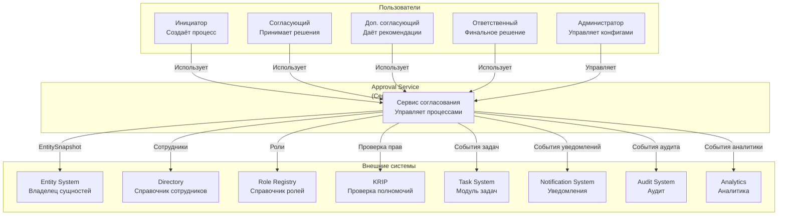

### 4.2 Описание

**Модуль «Согласование»** — центральный сервис управления процессами согласования.

**Пользователи:**

- **Инициатор** — создаёт процессы, редактирует маршруты, отзывает, создаёт ревизии.
- **Согласующий** — принимает решения.
- **Доп. согласующий** — даёт рекомендации, может добавлять других доп. согласующих.
- **Ответственный** — принимает финальное решение (UNIFIED), может быть участником.
- **Администратор** — управляет конфигами.

**Внешние системы:**

- **Entity System** — источник сущностей.
- **Directory** — справочник сотрудников.
- **Role Registry** — справочник ролей.
- **KRIP** — проверка полномочий.
- **Task System** — получает события о задачах.
- **Notification System** — получает события об уведомлениях.
- **Audit System** — получает события аудита.
- **Analytics** — получает события аналитики.

### 4.3 Ключевые взаимодействия

| Направление | Что передаётся | Протокол |
|---|---|---|
| Пользователи → Service | REST-запросы | HTTPS |
| Service → Entity System | Запросы снимков | REST |
| Service → Directory | Запросы сотрудников | REST |
| Service → Role Registry | Запросы ролей | REST |
| Service → KRIP | Запросы проверки | REST |
| Service → Task System | События | RabbitMQ |
| Service → Notification System | События | RabbitMQ |
| Service → Audit System | События | RabbitMQ |
| Service → Analytics | События | RabbitMQ |

---

## 5. C4 Level 2: Контейнеры

### 5.1 Диаграмма

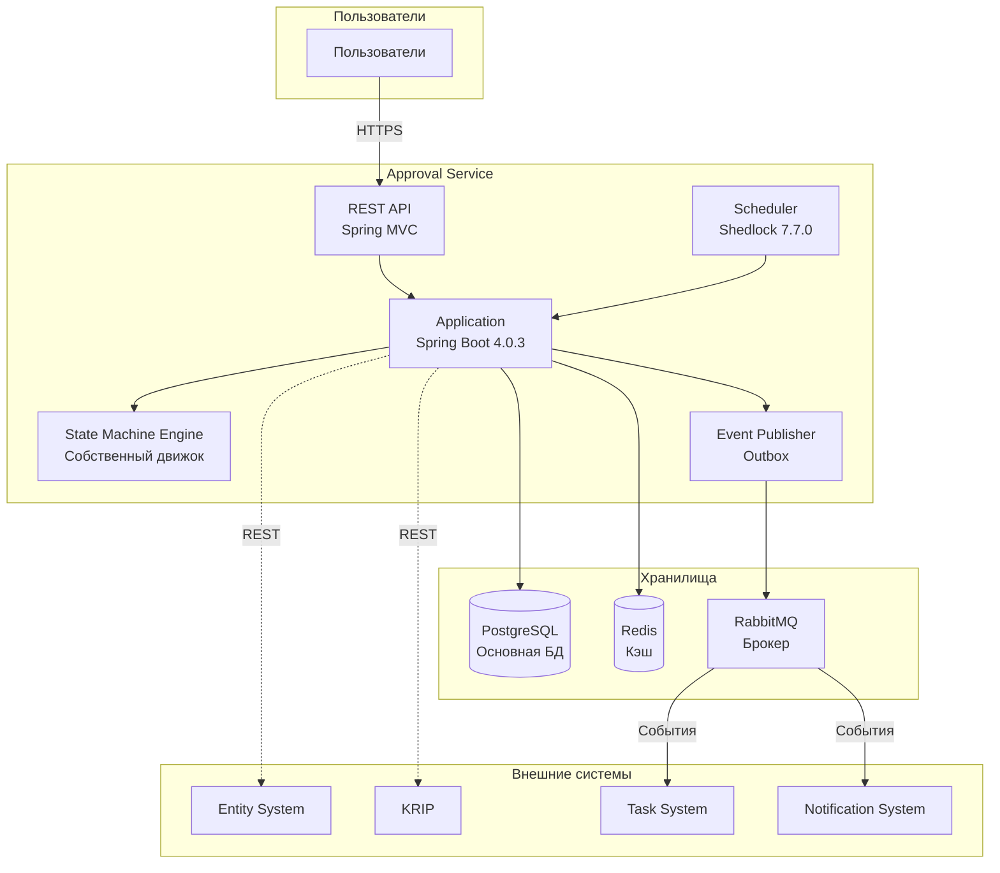

### 5.2 Описание контейнеров

| Контейнер | Описание | Технология |
|---|---|---|
| **REST API** | Входная точка для пользователей | Spring MVC |
| **Application** | Основное приложение | Spring Boot 4.0.3 |
| **State Machine Engine** | Движок машины состояний | Собственная реализация (ADR-028) |
| **Event Publisher** | Публикация событий через Outbox | Spring + JPA |
| **Scheduler** | Планировщик задач (автоархивация, таймеры) | Shedlock 7.7.0 |
| **PostgreSQL** | Основная база данных | PostgreSQL 13.7 → 16 |
| **Redis** | Кэш для агрегированных эндпоинтов | Redis 19.6.4 |
| **RabbitMQ** | Брокер для событий | RabbitMQ |

### 5.3 Обоснование выбора

| Контейнер | Почему |
|---|---|
| Spring Boot 4.0.3 | Актуальная поддерживаемая линия (OSS-поддержка до 2026-12-31); SSM 4.0.0 архивирован и более не является ограничением (см. ADR-028) |
| Собственный движок машины состояний | Реализует уже существующий, engine-agnostic контракт ADR-002 напрямую; не зависит от стороннего фреймворка, чей цикл поддержки нужно отслеживать (см. ADR-028) |
| PostgreSQL | Надёжность, JSONB, партиционирование |
| Redis | Скорость для агрегатов |
| RabbitMQ | Уже используется в проекте (auth-ms) |
| Shedlock | Распределённые блокировки планировщика |

### 5.4 Связи между контейнерами

| Откуда | Куда | Что | Синхронно? |
|---|---|---|---|
| REST API | Application | Вызовы сервисов | Да |
| Application | State Machine Engine | Переходы | Да |
| Application | PostgreSQL | Чтение/запись | Да |
| Application | Redis | Кэш | Да |
| Application | Event Publisher | Публикация | Да (в той же транзакции) |
| Event Publisher | RabbitMQ | Публикация событий | Асинхронно |
| Scheduler | Application | Триггеры | Асинхронно |
| Application | Entity System | REST | Да |
| Application | KRIP | REST | Да |

---

## 6. C4 Level 3: Компоненты Domain Core

### 6.1 Диаграмма

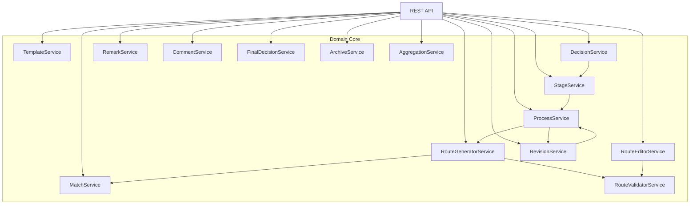

**Убрано (ADR-024):** `SubstitutionListener` — см. §6.2.15 ниже.

### 6.2 Описание компонентов

#### 6.2.1 TemplateService

**Назначение.** Управление шаблонами маршрутов.

**Ответственность:**
- Создание, редактирование, публикация шаблонов.
- Версионирование через `parentTemplateId`-цепочку (ADR-023 — без отдельной сущности «TemplateVersion»).
- Форк.
- Депрекация.
- Архивация.

**Зависимости:** `TemplateRepository`, `StageTemplateRepository`, `SlotTemplateRepository`.

#### 6.2.2 MatchService

**Назначение.** Подбор шаблонов по снимку сущности.

**Ответственность:**
- Получение `EntitySnapshot` через `EntityAdapter`.
- Применение `ApplicabilityRule`.
- Возврат списка применимых шаблонов.

**Зависимости:** `EntityAdapter`, `TemplateRepository`, `ApplicabilityRuleRepository`.

#### 6.2.3 RouteGeneratorService

**Назначение.** Генерация маршрута из шаблона.

**Ответственность:**
- Преобразование конкретной версии `Template` в `Route`.
- Резолвинг ролей в пользователей через `RoleResolverAdapter`.
- Расчёт сроков.
- Копирование `allowedReturnStages`.

**Зависимости:** `RoleResolverAdapter`, `TemplateRepository`.

#### 6.2.4 RouteEditorService

**Назначение.** Редактирование маршрута до запуска.

**Ответственность:**
- Замена пользователей.
- Замена организаций.
- Удаление слотов.
- Добавление доп. согласующих (в т.ч. иерархия).
- Проверка флагов.

**Зависимости:** `RouteValidatorService`, `RoleResolverAdapter`.

#### 6.2.5 RouteValidatorService

**Назначение.** Валидация маршрута.

**Ответственность:**
- Проверка обязательных слотов.
- Проверка сроков.
- Проверка соответствия ролей.
- Проверка полномочий через `KripAdapter`.
- Проверка `allowedReturnStages`.

**Зависимости:** `KripAdapter`, `RoleResolverAdapter`.

#### 6.2.6 ProcessService

**Назначение.** Управление процессами.

**Ответственность:**
- Создание процесса.
- Запуск, отзыв, возобновление.
- Создание ревизий.
- Завершение.

**Зависимости:** `StateMachineEngine`, `RouteGeneratorService`, `RouteValidatorService`, `ProcessRepository`.

#### 6.2.7 StageService

**Назначение.** Управление этапами.

**Ответственность:**
- Активация этапа.
- Управление итерациями этапа.
- Закрытие этапа.
- Возврат на этап.

**Зависимости:** `StageRepository`, `StageIterationRepository`.

#### 6.2.8 DecisionService

**Назначение.** Управление решениями основных участников. Не унифицировано с рекомендациями доп. согласующих (см. ADR-016) — те обрабатываются отдельно, через `AdditionalApproverService`/`ParticipantService`.

**Ответственность:**
- Запись решения.
- Валидация решений.
- Управление автосогласованием.
- Вызов `evaluateAggregation(stage)` и, для `executionOrder = Sequential`, назначение задачи следующему участнику (ADR-022).

**Зависимости:** `DecisionRepository`, `ParticipantRepository`.

#### 6.2.9 RemarkService

**Назначение.** Управление замечаниями.

**Ответственность:**
- Создание замечаний.
- Активация, пометка «не требуется».
- Исправление, отклонение.

**Зависимости:** `RemarkRepository` (вложения — поле `attachments: uuid[]` на самой сущности, см. ADR-026; отдельного `RemarkAttachmentRepository` нет).

#### 6.2.10 CommentService

**Назначение.** Управление комментариями.

**Ответственность:**
- Создание комментариев.
- Вложенные комментарии.

**Зависимости:** `CommentRepository` (вложения — поле `attachments: uuid[]` на самой сущности, см. ADR-026; отдельного `CommentAttachmentRepository` нет).

#### 6.2.11 FinalDecisionService

**Назначение.** Управление финальным решением.

**Ответственность:**
- Принятие финального решения (UNIFIED).
- Валидация.

**Зависимости:** `FinalDecisionRepository`.

#### 6.2.12 ArchiveService

**Назначение.** Управление архивацией.

**Ответственность:**
- Автоматическая архивация.
- Восстановление из архива.

**Зависимости:** `ProcessRepository`, `ArchiveMetadataRepository`.

#### 6.2.13 RevisionService

**Назначение.** Управление ревизиями документа.

**Ответственность:**
- Создание новой ревизии.
- Связывание с агрегатом.
- Прерывание предыдущего процесса.
- Валидация уникальности `revisionLabel`.

**Зависимости:** `ProcessRepository`, `TemplateRepository`.

#### 6.2.14 AggregationService

**Назначение.** Агрегация данных для Front.

**Ответственность:**
- Сборка `ApprovalView`.
- Сборка `RemarksList`.
- Вычисление `actions`.
- Кэширование через Redis.

**Зависимости:** все репозитории, `Redis`.

#### 6.2.15 SubstitutionListener — убрано (ADR-024)

Ранее описывался как слушатель событий `substitution.started`/`substitution.ended` от `Substitution System`, обновляющий `participant.userId`. Функциональность замещений убрана из модуля целиком — см. `11_adr.md` ADR-024. Компонент и его зависимости (`ParticipantService`, `EventPublisher` в этой роли) удалены.

---

## 7. C4 Level 3: Компоненты State Machine Engine

### 7.1 Диаграмма

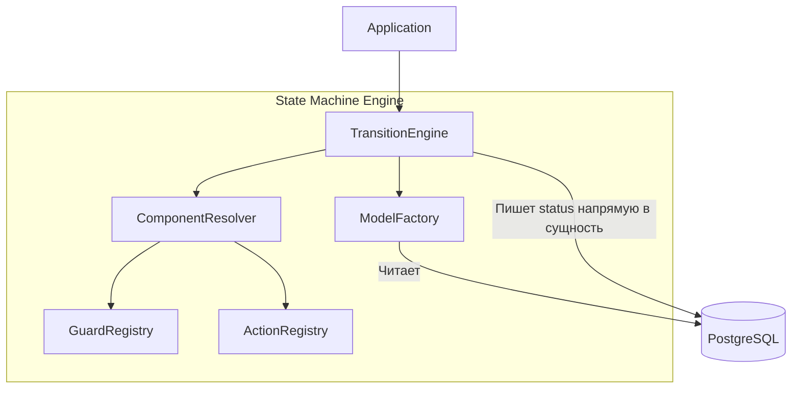

**Изменено (ADR-028).** Компонент `Persister`, ранее оборачивавший `JpaRepositoryStateMachinePersist` из Spring State Machine, убран полностью — движок не хранит сериализованный контекст (`extended_state`/`state_machine_context`) в отдельной таблице. Компонент `StateMachineFactory` заменён на `TransitionEngine`. Подробности замены — `11_adr.md` ADR-028.

### 7.2 Описание компонентов

#### 7.2.1 TransitionEngine

**Назначение.** Исполнение алгоритма перехода (собственная реализация, ADR-028; заменяет прежний `StateMachineFactory` на базе Spring State Machine).

**Ответственность:**
- Реализация алгоритма из `04_state_machines.md` §3.3: поиск переходов по `(entityType, fromState, trigger, processType)`, сортировка по `priority`, проверка guards, выполнение actions, смена `status`, публикация events, запись `AuditEvent`.
- Запись нового значения `status` непосредственно в сущность (`process_instance.status`, `stage_instance.status` и т.д.), в одной транзакции с actions и `AuditEvent`.
- Оптимистичная блокировка через поле `version` изменяемой сущности.

**Зависимости:** `ModelFactory`, `ComponentResolver`.

#### 7.2.2 ModelFactory

**Назначение.** Загрузка конфига карты переходов из БД.

**Ответственность:**
- Чтение `state_machine_config`, `state_config`, `transition_config`.
- Построение модели переходов для `TransitionEngine`.

**Зависимости:** `StateMachineConfigRepository`.

**Особенность.** Компонент не изменился по контракту при переходе с SSM на собственный движок (ADR-028) — он уже был кастомной надстройкой над конфигом в БД, а не частью самой SSM.

#### 7.2.3 Персистентность состояния (ADR-028)

**Назначение.** Хранение текущего состояния сущности.

**Как устроено.** Отдельного компонента-персистера нет. Текущее состояние хранится непосредственно в поле `status` самой сущности (`process_instance`, `stage_instance`, `participant` и т.д.), валидируемом через `status_registry` (ADR-015). `TransitionEngine` читает и обновляет это поле в той же транзакции, что и actions и `AuditEvent`. Отдельная таблица для сериализованного контекста (ранее — `ssm_state_machine_context`, `08_db_schema.md` §17) не используется и удалена из схемы.

#### 7.2.4 ComponentResolver

**Назначение.** Резолвинг guards и actions.

**Ответственность:**
- Получение guards и actions из Spring Context.
- Внедрение зависимостей.

**Зависимости:** `GuardRegistry`, `ActionRegistry`, Spring Context.

#### 7.2.5 GuardRegistry

**Назначение.** Реестр guards.

**Ответственность:**
- Регистрация guards.
- Поиск по коду.

**Зависимости:** `guard_registry` (БД).

#### 7.2.6 ActionRegistry

**Назначение.** Реестр actions.

**Ответственность:**
- Регистрация actions.
- Поиск по коду.

**Зависимости:** `action_registry` (БД).

---

## 8. C4 Level 3: Компоненты Adapters Layer

### 8.1 Диаграмма

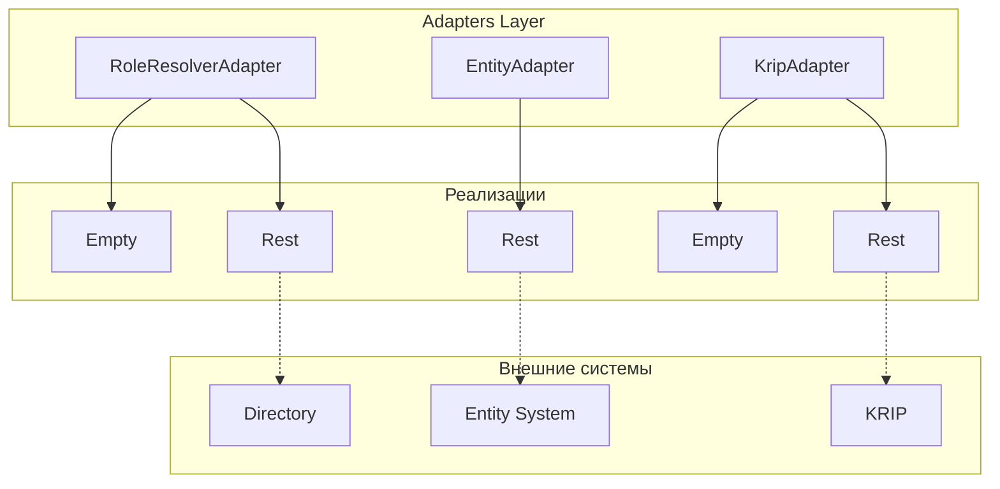

### 8.2 Описание

| Компонент | Назначение | Реализации |
|---|---|---|
| `RoleResolverAdapter` | Резолвинг ролей | Empty (default), Rest |
| `EntityAdapter` | Получение снимка сущности | Rest (обязательный) |
| `KripAdapter` | Проверка полномочий | Empty (default), Rest |

**Убрано (ADR-024):** `SubstitutionAdapter` (синхронная проверка замещений, Empty по умолчанию) — функциональность замещений убрана из модуля целиком.

### 8.3 Особенности

**Пустые реализации** используются по умолчанию для `RoleResolverAdapter`, `KripAdapter`.

**`EntityAdapter`** — единственный, у которого нет пустой реализации.

Подробности — в `09_adapters.md`.

---

## 9. C4 Level 3: Компоненты Persistence

### 9.1 Диаграмма

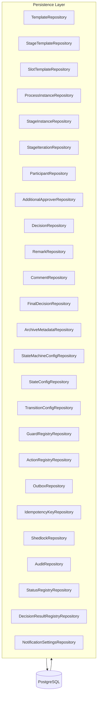

**Изменено:** `TemplateVersionRepository` убран (ADR-023 — версия хранится непосредственно на `Template`). `RemarkAttachmentRepository`/`CommentAttachmentRepository` убраны (ADR-026 — вложения хранятся как `attachments: uuid[]` на самой сущности). Добавлен `ShedlockRepository` (ADR-026/ADR-013). Добавлен `NotificationSettingsRepository` (ADR-027 — настраиваемая периодичность напоминаний, singleton-таблица `notification_settings`). **Убран `SSMContextRepository`** (ADR-028 — движок машины состояний заменён; текущее состояние хранится в поле `status` самой сущности, отдельная таблица персистентности контекста не используется).

### 9.2 Описание

**Репозитории** — Spring Data JPA репозитории для каждой таблицы.

**Особенности:**
- `@EntityGraph` для загрузки связанных сущностей.
- Batch-загрузка для коллекций.
- Partial-индексы для активных записей.

Подробности — в `08_db_schema.md`.

---

## 10. C4 Level 3: Компоненты Event Publisher

### 10.1 Диаграмма

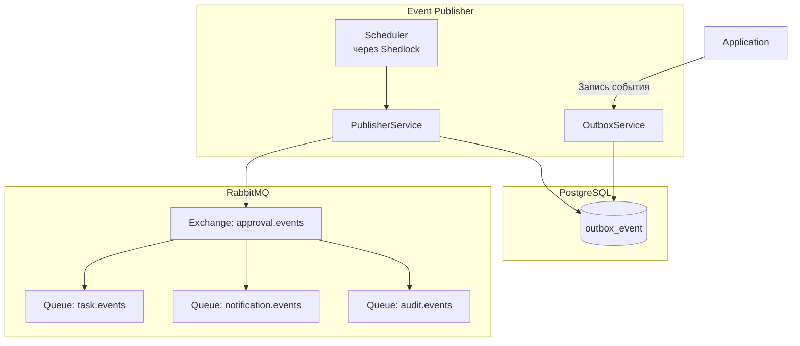

### 10.2 Описание

#### 10.2.1 OutboxService

**Назначение.** Запись события в Outbox.

**Ответственность:**
- Запись события в `outbox_event` в той же транзакции.
- Гарантия атомарности с изменением состояния.

#### 10.2.2 PublisherService

**Назначение.** Публикация событий из Outbox в RabbitMQ.

**Ответственность:**
- Чтение неопубликованных событий.
- Публикация в RabbitMQ.
- Обновление `published_at`.
- Обработка ошибок.

#### 10.2.3 Scheduler (Shedlock)

**Назначение.** Периодический запуск публикации.

**Ответственность:**
- Запуск `PublisherService` каждые N секунд.
- Защита от параллельного запуска через **Shedlock**.
- В multi-instance развёртывании только один экземпляр запускает публикацию.

---

## 11. C4 Level 3: Компоненты Scheduler

### 11.1 Назначение

Планировщик выполняет периодические задачи:

| Задача | Периодичность | Что делает |
|---|---|---|
| Публикация Outbox | Каждые 5 сек | Публикация неопубликованных событий |
| Автоархивация | Раз в день | Архивирует процессы ≥ 180 дней |
| Автосогласование по срокам | Каждые 5 мин | Отправляет timer-события для этапов с истёкшим сроком |
| Напоминания о застоях | Настраивается администратором (по умолчанию 24 ч) | Напоминает инициатору о процессах в OnRework |

**Периодичность напоминаний (ADR-027).** В отличие от остальных задач планировщика, периодичность `ReminderJob` — не хардкод. Она читается из таблицы `notification_settings` (`08_db_schema.md` §22, singleton: одна строка на весь модуль) при каждом запуске и настраивается администратором через `GET`/`PUT /admin/notification-settings` (`07_api_contract.md` §26) без релиза и без миграции. Если `notification_settings.reminder_enabled = false`, задача продолжает быть запланированной (сохраняет lock через Shedlock), но не выполняет рассылку. Гранулярность per-шаблон/per-тип процесса не введена — настройка глобальная, симметрично `ArchiveSettings` (§13.3 `04_state_machines.md`); см. ADR-027 для обоснования.

### 11.2 Диаграмма

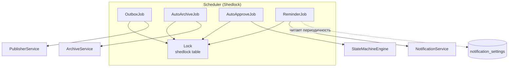

### 11.3 Роли Shedlock

**Зачем.** В multi-instance развёртывании каждый экземпляр запускает свой планировщик. Без координации задача выполнится несколько раз.

**Как.** Shedlock использует таблицу `shedlock` в БД для блокировки (полная DDL — `08_db_schema.md` §18, ADR-026). Только один экземпляр получает блокировку и выполняет задачу.

**Пример:**

```java
@Scheduled(cron = "0 */5 * * * *")
@SchedulerLock(name = "outboxPublisher", 
               lockAtMostFor = "4m", 
               lockAtLeastFor = "1m")
public void publishOutbox() {
    publisherService.publish();
}
```

---

## 12. Потоки данных

### 12.1 Поток: создание и запуск процесса (STANDARD)

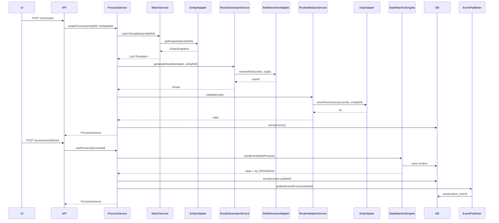

### 12.2 Поток: принятие решения

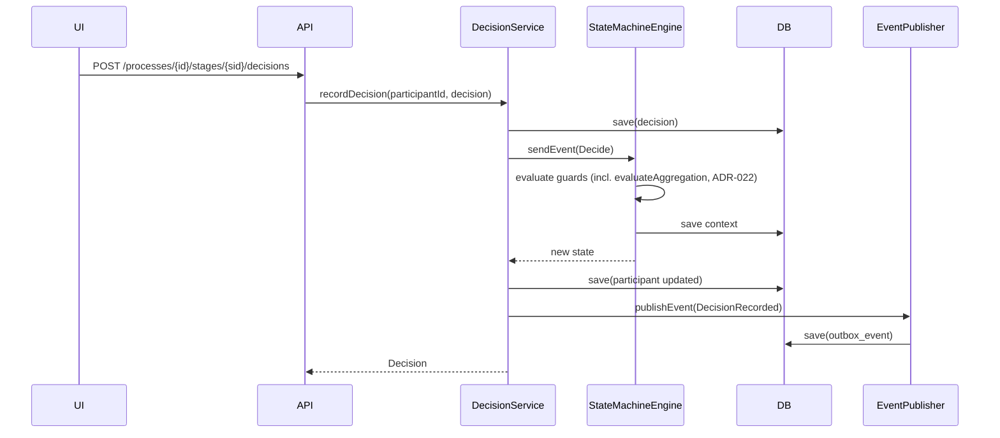

### 12.3 Поток: возврат на этап

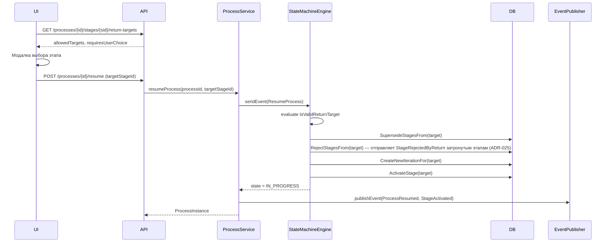

### 12.4 Поток: создание ревизии

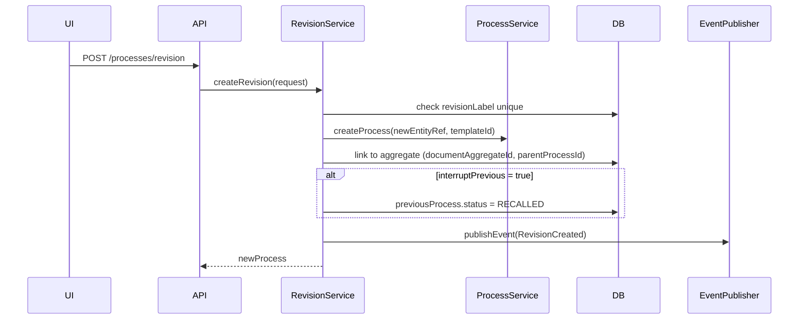

### 12.5 Поток: агрегация для Front

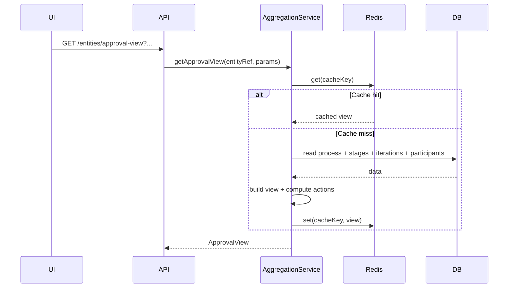

### 12.6 Поток: автоархивация

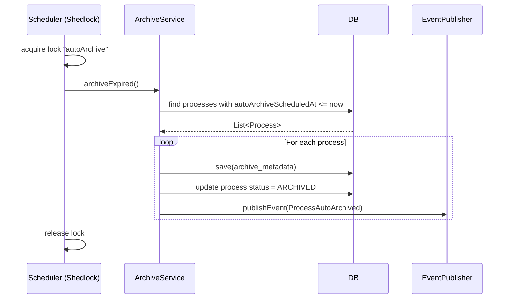

**Убрано (ADR-024):** «Поток: замещение» (событие от `Substitution System` через `SubstitutionListener`) — функциональность замещений убрана из модуля целиком.

---

## 13. Развёртывание

### 13.1 Схема

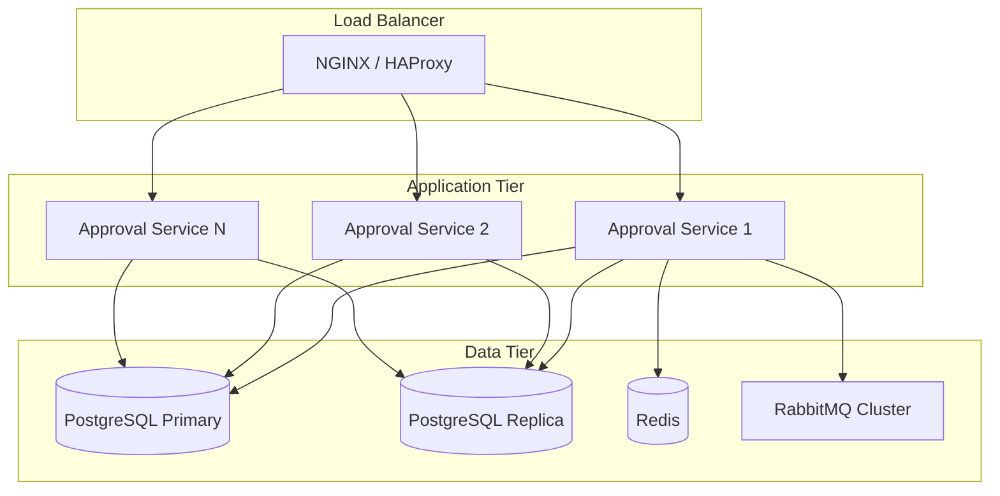

### 13.2 Компоненты развёртывания

| Компонент | Экземпляры | Описание |
|---|---|---|
| Load Balancer | 2 (HA) | Балансировка |
| Approval Service | 3+ | Горизонтальное масштабирование |
| PostgreSQL Primary | 1 | Запись |
| PostgreSQL Replica | 1+ | Чтение |
| Redis | 1+ | Кэш |
| RabbitMQ | 3+ | Брокер |

### 13.3 Окружения

| Окружение | Назначение |
|---|---|
| Development | Локальная разработка |
| Test | Автотесты |
| Staging | Предпродакшн |
| Production | Прод |

---

## 14. Масштабирование

### 14.1 Что масштабируется

| Компонент | Тип | Как |
|---|---|---|
| Approval Service | Горизонтальное | stateless, за LB |
| PostgreSQL | Вертикальное + реплики | read replicas |
| Redis | Горизонтальное | cluster |
| RabbitMQ | Горизонтальное | cluster + queues |

### 14.2 Ключи маршрутизации

| Что | Ключ | Зачем |
|---|---|---|
| RabbitMQ events | `routing_key = aggregateId` | Порядок событий по сущности |
| Redis cache | `entityId` | Кэш по сущности |

### 14.3 Stateless

**Approval Service** — stateless. Все состояние в БД или Redis.

**Зачем.** Горизонтальное масштабирование без sticky sessions.

### 14.4 Распределённый планировщик

**Shedlock** решает проблему multi-instance:
- Только один экземпляр запускает задачу.
- Блокировка через БД (таблица `shedlock`, см. `08_db_schema.md` §18).
- Гарантия: автоархивация не запустится дважды.

### 14.5 Bottlenecks

| Потенциальный bottleneck | Митигация |
|---|---|
| БД при агрегатах | Read replicas + Redis кэш |
| Публикация событий | Много очередей RabbitMQ |
| State machine transitions | Индексы БД + batch |

---

## 15. Отказоустойчивость

### 15.1 Сценарии отказов

| Сценарий | Поведение |
|---|---|
| Approval Service упал | LB перенаправляет на другой экземпляр |
| PostgreSQL Primary упал | Failover на Replica |
| Redis упал | Fallback на прямое чтение из БД |
| RabbitMQ упал | Outbox сохраняет события, публикует позже |
| Внешняя система (KRIP) упала | Fallback адаптера (не блокируем) |

### 15.2 Обработка ошибок

| Тип ошибки | Стратегия |
|---|---|
| Транзиентные (сеть) | Retry с backoff |
| Логические (валидация) | Возврат ошибки клиенту |
| Системные | Логирование + метрики |

### 15.3 Гарантии доставки

**События:** at-least-once.

**Обоснование:** простота; подписчики идемпотентны.

### 15.4 Восстановление

| Что | Как |
|---|---|
| Состояние процесса | Хранится непосредственно в поле `status` сущности (ADR-028); отдельного восстановления контекста не требуется |
| События | Из `outbox_event` (если не опубликованы) |
| Кэш | Прогревается при следующем запросе |

---

## 16. Наблюдаемость

### 16.1 Логи

**Структурированное логирование** в JSON.

**Сбор:** Promtail → Loki → Grafana.

**Уровни:**
- `INFO` — значимые события.
- `WARN` — потенциальные проблемы.
- `ERROR` — ошибки.

**Correlation ID** — через все слои.

### 16.2 Метрики

**Минимальный набор:**

| Метрика | Описание |
|---|---|
| `http_requests_total` | HTTP-запросы |
| `http_request_duration` | Длительность запросов |
| `sm_transitions_total` | Переходы SM |
| `adapter_calls_total` | Вызовы адаптеров |
| `outbox_events_pending` | Неопубликованные события |
| `db_query_duration` | Длительность запросов БД |
| `shedlock_job_duration` | Длительность задач планировщика |

**Инструменты:** Micrometer + Prometheus + Grafana.

### 16.3 Трассировка

**Опционально.** Distributed tracing через OpenTelemetry.

### 16.4 Health Checks

**Endpoints:**
- `/actuator/health` — общее состояние.
- `/actuator/health/db` — БД.
- `/actuator/health/redis` — Redis.
- `/actuator/health/rabbit` — RabbitMQ.

---

## 17. Безопасность

### 17.1 Аутентификация

**JWT Bearer Token.**
- Токен в заголовке `Authorization`.
- Проверка подписи.
- Проверка срока действия.

### 17.2 Авторизация

**RBAC + ABAC.**
- **RBAC** — роль пользователя.
- **ABAC** — атрибуты ресурса.

### 17.3 Защита данных

- Все запросы — по HTTPS.
- Пароли и секреты — через Vault / K8s Secrets.
- PII — маскируется в логах.

### 17.4 Аудит

**Все критичные действия** фиксируются в `audit_event`.

### 17.5 Rate Limiting

**Опционально:** через API Gateway.

---

## 18. Технологический стек

### 18.1 Платформа

| Компонент | Версия | Назначение |
|---|---|---|
| Java | 21 | Язык разработки |
| Gradle | 8.14 | Сборка (уточнено 2026-09-19 — Spring Boot 4.0.3 Gradle-плагин требует Gradle ≥8.14; см. `11_adr.md` ADR-028 §30.6) |
| Spring Boot | 4.0.3 | Основа приложения |
| Spring Cloud | 2025.1.1 | Экосистема |
| State Machine Engine | Собственная реализация | Движок машины состояний (ADR-028) |
| Hibernate | 7.4.0 | ORM |
| Lombok | 1.18.42 | Boilerplate |
| MapStruct | 1.6.3 | Маппинг DTO |
| Swagger (springdoc) | 2.2.43 | OpenAPI-документация |
| Apache Commons | 3.20.0 | Утилиты |

**Обоснование выбора Spring Boot 4.0.3 (ADR-028):**
- Актуальная линия в рамках официальной OSS-поддержки (до 2026-12-31) — вся ветка 3.x полностью вышла из поддержки.
- Spring State Machine, ради совместимости с которым ранее была принята версия 3.2.7 (ADR-021), официально архивирован и не поддерживает Boot 4 — движок заменён собственной реализацией (ADR-028), препятствие снято.
- 4.0.3, а не более новая 4.1.x — решение пользователя: более длительно обкатанный патч-релиз в рамках линии 4.0.

**Обоснование замены движка машины состояний (ADR-028):**
- Модель ADR-002 (Data-Driven State Machine) изначально engine-agnostic — состояния/переходы как данные, guards/actions как Spring-бины; замена движка не требует изменения этой модели.
- Алгоритм перехода уже полностью специфицирован (`04_state_machines.md` §3.3), что делает реализацию собственного движка низкорисковой.
- Устраняет зависимость от архивированной библиотеки на неподдерживаемой платформе.

### 18.2 Данные

| Компонент | Версия | Назначение |
|---|---|---|
| PostgreSQL | 13.7 → 16 | Основная БД |
| Redis | 19.6.4 | Кэш для агрегатов |
| Flyway / Liquibase | уточнить | Миграции |

### 18.3 Обмен сообщениями

| Компонент | Версия | Назначение |
|---|---|---|
| RabbitMQ | (уже в проекте) | Брокер для доменных событий |
| Shedlock | 7.7.0 | Распределённые блокировки планировщика |

**Обоснование RabbitMQ:**
- Уже используется в проекте (для `auth-ms`).
- Не требует добавления новой инфраструктуры.
- Достаточен для домена согласования.

**Обоснование Shedlock:**
- Решает проблему распределённых блокировок.
- Уже используется в проекте.
- Критично для автоархивации в multi-instance.

### 18.4 Тестирование

| Компонент | Версия | Назначение |
|---|---|---|
| Testcontainers | 1.21.4 | Интеграционные тесты |
| JUnit | 5 | Юнит-тесты |

### 18.5 Инфраструктура

| Компонент | Версия | Назначение |
|---|---|---|
| Argo | 3.1.6 | Оркестрация |
| GitLab | — | CI/CD |
| Grafana | 9.2.2 | Дашборды |
| Loki + Promtail | — | Логи |
| Prometheus | — | Метрики (опционально) |

### 18.6 Что НЕ используем

| Компонент | Почему |
|---|---|
| Kafka | Используем RabbitMQ |
| Spring State Machine | Архивирован разработчиками, не поддерживает Spring Boot 4 — заменён собственным движком (ADR-028) |
| openhtmltopdf | Экспорт PDF вне модуля |
| apache.poi | Экспорт Excel вне модуля |
| bouncycastle | ЭЦП вне модуля |
| MinIO | Файловое хранилище вне модуля |
| mailpit | Уведомления вне модуля |
| Go | Модуль на Java |

---

## 19. Сводная таблица компонентов

### 19.1 По контейнерам

| Контейнер | Компоненты |
|---|---|
| REST API | Controllers |
| Application | Domain Services (14) |
| State Machine Engine | TransitionEngine, ModelFactory, Resolver, Registries (ADR-028) |
| Adapters Layer | 3 адаптера |
| Persistence | Repositories (25) |
| Event Publisher | OutboxService, PublisherService, Scheduler |
| Scheduler | 4 задачи через Shedlock |

### 19.2 По функциям

| Функция | Компоненты |
|---|---|
| Шаблоны | TemplateService, TemplateRepository |
| Подбор | MatchService, EntityAdapter |
| Генерация | RouteGeneratorService, RoleResolverAdapter |
| Валидация | RouteValidatorService, KripAdapter |
| Процессы | ProcessService, StateMachineEngine |
| Этапы | StageService |
| Итерации | StageService |
| Решения | DecisionService |
| Замечания | RemarkService |
| Комментарии | CommentService |
| Доп. согласующие | ParticipantService |
| Возврат на этап | ProcessService, StageService |
| Ревизии | RevisionService |
| Финальное решение | FinalDecisionService |
| Архивация | ArchiveService, Scheduler |
| Агрегация | AggregationService, Redis |
| Настройки напоминаний | NotificationSettingsService (ADR-027) |

**Убрано (ADR-024):** строка «Замещения | SubstitutionListener».

---
